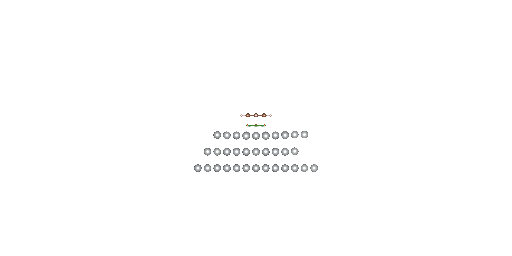
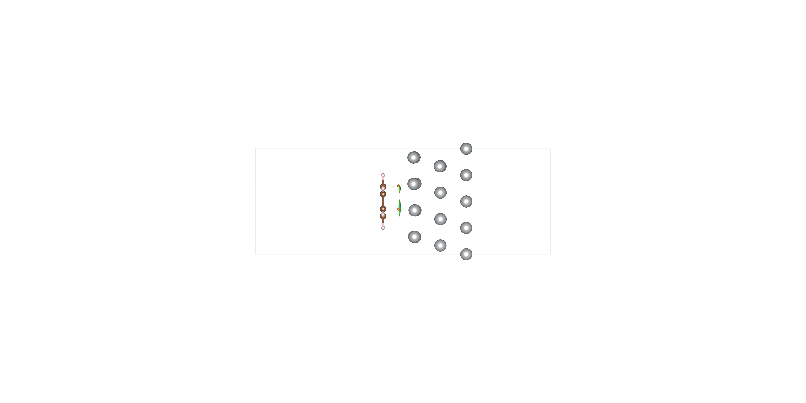
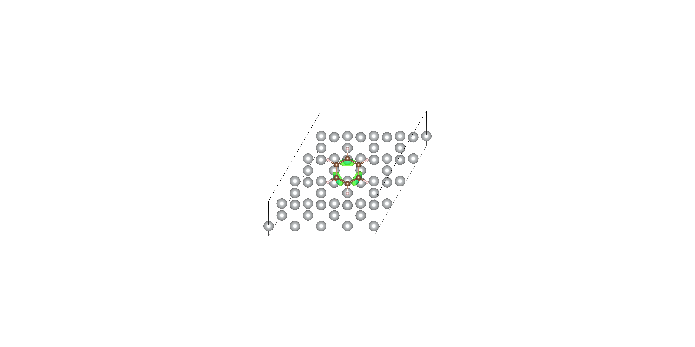
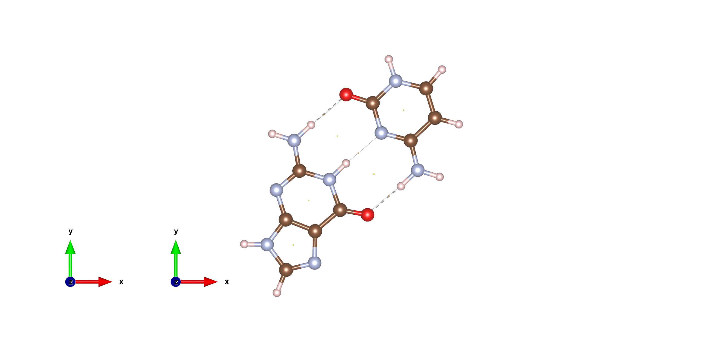
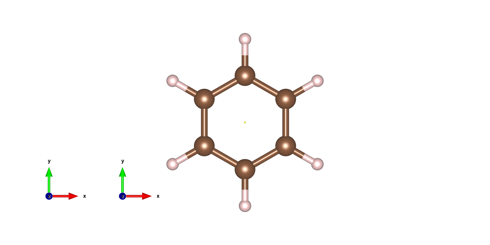
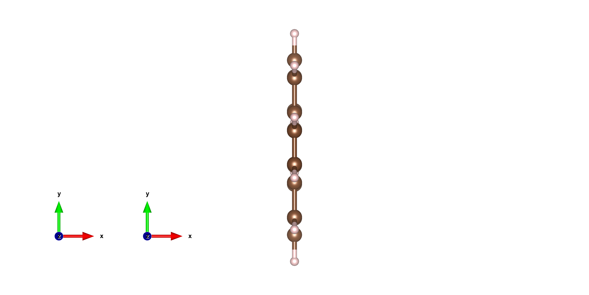
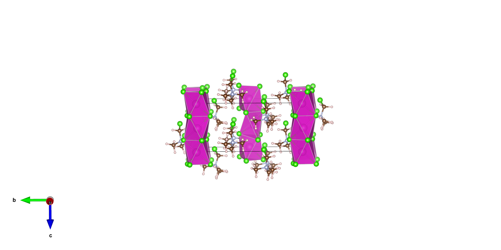
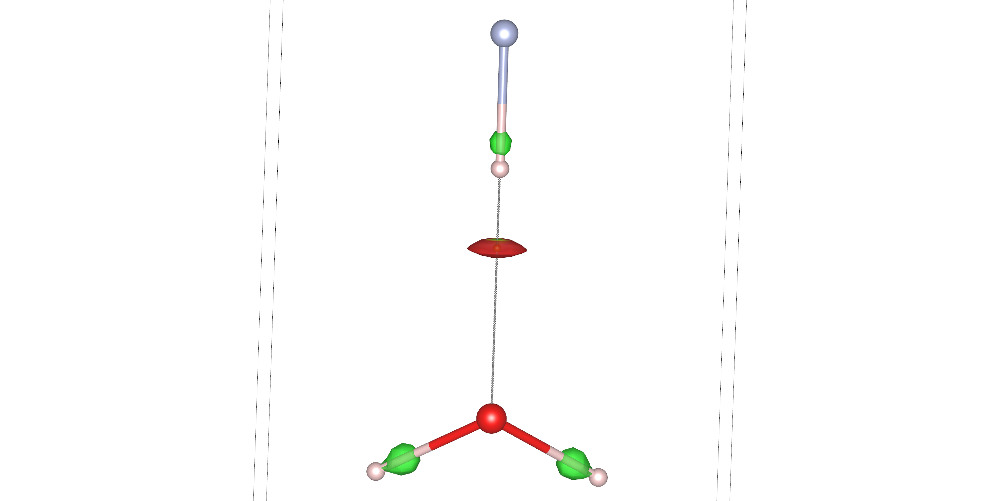
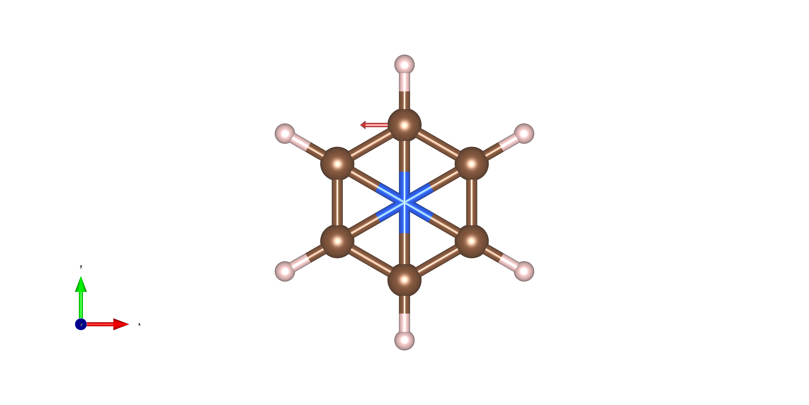

# multiwfn2vesta 效果图库和真实算例索引

本文件只收录已经在当前工作区真实生成过的 VESTA/PNG 结果。没有真实渲染过的功能不在这里冒充完成，而是在
`example_status_matrix_zh.md` 中标为待补图。

当前总览图把已经整理进项目的真实渲染图拼在一起，方便快速确认可展示资产：


当前闭环展示图用同一批真实 VESTA PNG 重新排版成手册友好的 6-panel 预览：


按功能反查 example 覆盖状态见 `feature_examples_zh.md`，命令入口是
`multiwfn2vesta examples --coverage`。想先看当前闭环概况、缺图数量和下一批优先体系时用：

```bash
multiwfn2vesta examples --summary
```

只想列出已经提交到项目内的 PNG 时用：

```bash
multiwfn2vesta examples --gallery-assets
```

准备新 example 前，先用下面的命令看推荐真体系，避免用 toy placeholder 冒充成品：

```bash
multiwfn2vesta examples --systems
```

体系选择依据见 [真实算例体系选择依据](research/valuable_systems_for_examples_zh.md)。

## 高价值代表体系

| 体系 | 用途 | 为什么有价值 | 当前状态 |
| --- | --- | --- | --- |
| Ag(111)+benzene | 周期性表面吸附体系的 IGMH+AIM 叠图和三视图 | 代表 ABACUS LCAO Molden -> Multiwfn -> VESTA 的主线，保留周期性信息，能展示表面-分子相互作用 | 有 VESTA、cube 和高清三视图 |
| GC 碱基对 / benzene | AIM 拓扑路径和 BCP 可视化 | GC 更适合作为氢键/分子间 AIM 主图，benzene 适合作基础演示 | 有 VESTA 和 PNG |
| Cd/Cl 轨迹视频 | VESTA 轨迹视频帧 | 代表 trajectory -> VESTA frame -> PNG/video 的批处理路线 | 有 poster frame 和高码率 mp4；XYZ/extXYZ->VESTA frame 已有 `trajectory-frames` CLI，PNG->mp4 合成层已有 `trajectory-video` CLI |
| H2O-HF | IRI+AIM 叠图、IRI 纹理范围调试 | 当前更适合作 IRI/AIM 调试证据，不应作为手册级成品图 | 有 VESTA、cube 和 PNG，但状态为待完善 |
| benzene dimer / phenol dimer | IRI/RDG/DORI/RoSE/SEDD/on-top pair density | 小而直观的弱相互作用体系，适合 paired scalar 对比；phenol dimer 可作为公开教程 fallback | 待准备 Molden/cube 和手册图 |
| COF_12000N2 单层 | ABACUS direct cube、ELF/ESP、孔道/原子染色 | 周期多孔 2D 材料能展示 cell、真空层、孔道和 direct cube workflow | 待单层化、单点 cube 和 PNG |
| 反应性芳香分子 / coronene | Fukui、dual descriptor、condensed atom coloring | 可同时覆盖 charged-state cube arithmetic 和原子数值染色 | 待准备同网格三态 cube |
| benzene NICS vector | VESTA 箭头/矢量杂项 | 芳香性相关矢量展示的原型；按用户要求暂不进主代码 | 有 VESTA 和 PNG，仅作为杂项保留 |

## Ag(111)+benzene: IGMH+AIM 三视图

输入来自 ABACUS LCAO Molden 和 Multiwfn 产物：

- Molden: `smoke/abacus_server_artifacts_20260606/ag111_benzene/ag111_benzene_lcao_cont3_nval.molden`
- IGMH cubes: `smoke/ag111_benzene_igmh_aim_periodic_cell_20260607/products/dg_inter.cub`,
  `smoke/ag111_benzene_igmh_aim_periodic_cell_20260607/products/sl2r.cub`
- AIM PDB: 同目录下的 `paths_*` / `CPs_*` 中间文件
- 最终渲染目录:
  `smoke/ag111_benzene_igmh_aim_periodic_cell_20260607/three_views_cli_rotate_split_bcp_final_20260609/`

示例命令形态：

```bash
multiwfn2vesta aim-igmh input_overlay.vesta products \
  --label-bcp-sites \
  --render-three-views \
  --initial-view top \
  --extra-rotate top x -8 \
  --scale 2
```







## AIM: GC 碱基对和 benzene

这些例子来自 Sobereva AIM 教程相关体系的本地复现烟测，适合检验 `paths.pdb`/`CPs.pdb` 到
atoms-only VESTA 的转换，以及把 AIM phase 叠到普通分子结构上的样式。

源目录：

- `smoke/20260605_sob445_more_aim_examples/gc/`
- `smoke/20260605_sob445_more_aim_examples/benzene/`
- `smoke/20260605_sob445_more_aim_examples/phenanthrene/` 也有 PNG，但当前视角信息量较弱，暂不作为主图。

示例命令形态：

```bash
multiwfn2vesta aim-pdb paths.pdb aim_atoms_only.vesta --cps-pdb CPs.pdb
```





Phenanthrene 的现有图保留为审计证据，后续需要重新调整视角后再进入手册主图：



## Cd/Cl 轨迹视频

这个例子来自 `smoke/vesta_trajectory_video_1608`，用于 VESTA 批量帧渲染、参考样式复用、Boundary
和成键判据控制。当前已经有高码率 mp4；`trajectory-frames` 已维护 XYZ/extXYZ 到 VESTA frame，
`trajectory-video` 已维护 PNG 序列到 mp4 的合成层，后续应继续把 ASE `.traj` 读取和 VESTA PNG
渲染整理为稳定 CLI。

源目录：

- NVT 高码率视频:
  `smoke/vesta_trajectory_video_1608/ase_nvt_refstyle_stride20_cdcl3p50/ase_nvt_refstyle_stride20_cdcl3p50_hq20m.mp4`
- NVT poster frame:
  `smoke/vesta_trajectory_video_1608/ase_nvt_refstyle_stride20_cdcl3p50/png/frame_0001.png`
- NPT 参考样式也有视频:
  `smoke/vesta_trajectory_video_1608/ase_npt_refstyle_stride20/ase_npt_refstyle_stride20_hq20m.mp4`
- 项目内 artifact manifest:
  `../examples/cdcl_trajectory_video/artifact_manifest.json`

验证命令：

```bash
multiwfn2vesta examples --id cdcl_trajectory_video --verify
multiwfn2vesta examples --id cdcl_trajectory_video --verify-smoke
multiwfn2vesta trajectory-frames ../examples/cdcl_trajectory_video/cdcl_tiny.extxyz \
  /tmp/cdcl_vesta_frames \
  --bond Cd Cl 0 3.5 \
  --boundary -0.05 1.05 -0.05 1.05 -0.05 1.05
multiwfn2vesta trajectory-video \
  --manifest ../examples/cdcl_trajectory_video/artifact_manifest.json \
  --output /tmp/cdcl_trajectory.mp4 \
  --fps 24 \
  --bitrate 20M
```


较早的 NPT frame 作为补充证据保留：



## H2O-HF: IRI+AIM 调试证据

这个例子用于验证 IRI/RDG surface cube 与 sign(lambda2)rho-like texture cube 的 VESTA 写法，
以及 AIM PDB 坐标对齐、关闭 sections、纹理百分比范围换算等经验。当前 PNG 仍偏调试性质，IRI 等值面和
AIM 叠图还没有形成足够清晰的展示成品，因此不标为“已闭环”。

源目录：

- `smoke/20260605_iri_aim_h2o_hf/products/`
- 调试图:
  `1h2o_hf_iri2_plus_aim_cube_frame_irifill_small_nosect_texrange.png`

示例命令形态：

```bash
multiwfn2vesta iri-run input.molden iri_products --timeout 300
multiwfn2vesta cube-preset iri h2o_hf_IRI2_surface.cub iri_products \
  --texture-cube h2o_hf_IRI1_color.cub \
  --tex-physical -0.04 0.04 \
  --tex-range-source surface-band
```



## NICS / 磁感生电流箭头杂项

用户已要求 NICS 箭头暂不进主代码，作为杂项保留。这里仅记录 VESTA 箭头原型，供以后恢复维护时参考。

源目录：

- `smoke/20260605_nics_vesta_vectors/`



## 缺图优先级

后续补图建议按下面顺序推进：

1. Ag(111)+benzene IGMH+AIM: 重渲染一套更紧凑的 camera/zoom，减少留白。
2. GC AIM: 补一个更适合手册的无重复坐标轴版本。
3. IRI+AIM: 继续解析 VESTA `SURFS`/`SECTS`/`TEX3P`，直到 IRI 等值面和 AIM 叠图清楚。
4. ABACUS 直接 cube: charge density、potential-on-density、ELF、partial charge、wavefunction norm。
5. Multiwfn `grid-run`: density/orbital/spin/KED/ELF/LOL/ESP/ALIE/LEA/vdW/component vdW/FOD/OW-Fukui/信息论密度。
6. RoSE/SEDD: 用 benzene dimer 或 GC 碱基对渲染一组 paired figure，先试 `0.5` 等值面再按 cube 范围调参；公开 fallback 可用 phenol dimer 类弱相互作用体系。
7. `cube-arith` 和 `fukui-run`: density difference、spin density、Fukui+/-/0、dual descriptor；coronene 或带杂原子的芳香体系比 toy 小分子更适合手册图。
8. surface extrema: 用 phenol、含氟/硝基芳香体系或 GC 的 ALIE/LEA/LEAE 表面极值补一张点标记图。
9. `stm-run`、`domain-run`、basin cube: 当前有 VESTA/cube 烟测，但缺真正渲染图。
10. atom coloring: ABACUS Mulliken 和 Multiwfn 原子表染色已有 VESTA 烟测，缺真实电荷/磁矩或 condensed Fukui 对比 PNG。
