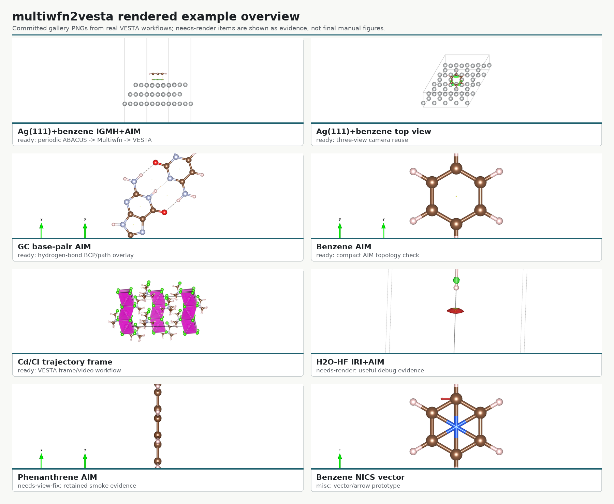

# multiwfn2vesta 功能到算例闭环索引

本索引用来回答“某个功能现在应该拿什么真实体系演示、有没有效果图、下一步缺什么”。它和
`multiwfn2vesta examples --coverage` 保持同一套状态语言。

状态含义：

- `ready`: 已有正式 runbook 和项目内 gallery PNG，可以作为手册级示例。
- `linked`: 功能被某个 ready workflow 间接覆盖，但还没有独立教程图。
- `needs-render`: 代码路径和 smoke/经验已存在，需要补一张手册级效果图。
- `needs-example`: 还缺真实体系或完整输入输出链路。
- `misc`: 用户要求暂存或暂不进主代码的探索项。

## 快速命令

```bash
multiwfn2vesta examples --coverage
multiwfn2vesta examples --needs-render
multiwfn2vesta examples --coverage --coverage-status ready
multiwfn2vesta examples --coverage --json
```

## 顶层功能覆盖表

| 功能 | 推荐体系 | 当前状态 | 项目内图 | 下一步 |
| --- | --- | --- | --- | --- |
| `discover` | 本工作区 Multiwfn/VESTA | linked | 无 | 如需教学截图，记录一段成功输出即可 |
| `abacus-molden` | Ag(111)+benzene ABACUS LCAO | linked | `assets/gallery/ag111_benzene_igmh_aim_front.png` | 把真实 ABACUS 目录结构和成功输出片段补进 runbook |
| `molden-check` | Ag(111)+benzene Molden，保留 `[Nval]` | linked | Ag 三视图间接覆盖 | 在中文手册加入一段成功检查输出 |
| `cube-vesta` | H2O-HF IRI surface cube，后续换 direct density cube | needs-render | `assets/gallery/h2o_iri_aim_overlay.png` 仅作调试证据 | 补一张独立 cube 等值面图 |
| `cube-preset` | Ag(111)+benzene IGMH、H2O-HF IRI、ABACUS direct cube | linked | Ag 三视图、IRI 调试图 | 补 ABACUS charge density/potential/ELF/wavefunction norm 图 |
| `surface-extrema` | 极性芳香分子或吸附界面 ALIE/LEA/LEAE | needs-render | 无 | 真实生成 `surfanalysis.pdb` 后叠加 extrema |
| `cube-arith` | 反应性分子的 Fukui/dual 或 open-shell spin density | needs-example | 无 | 准备 charged-state 或 spin-resolved cube |
| `iri-run` | H2O-HF、GC 碱基对或 benzene dimer | needs-render | H2O-HF 调试图 | 重渲染清楚的 IRI 等值面和染色范围 |
| `igmh-run` / `igm-run` / `migm-run` | Ag(111)+benzene | ready | Ag 三视图 | 保留 Ag 为周期体系主例，另补小分子快速例 |
| `aigm-run` / `amigm-run` | benzene dimer 轨迹或 Ag(111)+benzene AIMD 片段 | needs-example | 无 | 生成短轨迹平均 IGM cube 并渲染 |
| `grid-run` | H2O、benzene、Ag(111)+benzene、未来 COF | needs-render | 无手册级图 | 按函数组补 density/orbital/KED/ELF/ESP/vdW/FOD 等图 |
| `grid-run --function rose/sedd` | benzene dimer、GC 碱基对或类似弱相互作用/芳香体系 | needs-render | 无 | 已有 RoSE/SEDD CLI 和 preset；下一步在同一真实体系中渲染 paired figure |
| `fukui-run` | 带杂原子的芳香分子，中性/阴/阳离子三态 | needs-example | 无 | 先固定同一网格的三态 density cube |
| `stm-run` | 表面吸附小分子或芳香分子局域态 | needs-render | 无 | 选择 LDOS 能窗并渲染 constant-current surface |
| `domain-run` | H2O density domain 或 COF 孔道区域 | needs-render | 无 | 渲染二值 domain surface 并记录 criterion |
| `abacus-mulliken-color` | 磁性或带电 ABACUS 体系 | needs-render | 无 | 用真实 `mulliken.txt` 生成电荷/磁矩染色 PNG 和图例 |
| `multiwfn-atom-color` | Multiwfn 原子电荷或 condensed Fukui 表 | needs-render | 无 | 接真实 atom scalar table 并渲染 |
| `aim-run` | GC 碱基对、benzene | ready | `assets/gallery/gc_aim_overlay.png` | GC 做氢键主例，benzene 做基础例 |
| `aim-pdb` | Multiwfn `paths.pdb` / `CPs.pdb` | ready | GC、benzene AIM 图 | 补 CP 类型颜色说明 |
| `aim-igmh` | Ag(111)+benzene | ready | Ag 三视图 | 继续改善不抢焦点渲染和 camera preset |
| `trajectory-frames` | Cd/Cl extXYZ 轨迹 | ready | `assets/gallery/cdcl_nvt_trajectory_frame.png` | 后续补 ASE `.traj` 直接读取 |
| `trajectory-video` | Cd/Cl VESTA PNG frame 序列 | ready | Cd/Cl poster frame | 后续补不抢焦点 PNG 渲染层 |
| `examples` | 文档/算例发现入口 | ready | `assets/gallery/current_feature_overview.png` | 继续把 smoke 逐步提升为正式 example |

## 推荐真实体系组合

当前最有价值、且能覆盖最多功能的体系组合如下：

1. Ag(111)+benzene 周期性吸附体系：覆盖 ABACUS Molden、Molden 检查、IGMH、AIM、AIM+IGMH 三视图、vdW/ESP 类 grid-run 后续扩展。
2. GC 碱基对：覆盖 AIM 氢键拓扑，适合继续补 IRI/RDG、ESP-on-density、surface extrema。
3. H2O-HF 或 benzene dimer：覆盖 IRI/RDG、DORI、Delta-g 和小分子弱相互作用快速调试。
4. COF_12000N2 单层加真空层：适合 ABACUS direct cube、电子密度、静电势、ELF/LOL、原子电荷染色。
5. 真实 open-shell 或磁性体系：适合 spin density、ABACUS Mulliken magnetism coloring、Multiwfn atom table coloring。
6. Cd/Cl NVT/NPT 轨迹：覆盖 trajectory frame、reference VESTA style、Boundary、成键判据和高码率视频。

## grid-run 函数组到示例

`grid-run` 功能很多，不应要求每个函数都单独维护一个大算例；更可维护的闭环方式是按物理含义分组：

| 函数组 | 推荐体系 | 展示方式 |
| --- | --- | --- |
| density、gradient、Laplacian | H2O 或 benzene | standalone isosurface；density 也作为 surface cube |
| orbital、orbital-density | benzene HOMO/LUMO | signed 或 orbital-density preset |
| spin-density、spin-polarization、alpha/beta density | open-shell/磁性体系 | signed spin-density surface，另配 atom coloring |
| KED、Thomas-Fermi、Weizsacker、Pauli KED | H2O/benzene | positive KED isosurface 或映射到 density surface |
| ELF/LOL | COF 或芳香分子 | ELF/LOL 等值面，必要时配 density frame |
| ESP、electron-only ESP、positive/negative ESP、electric field magnitude | 极性分子、Ag(111)+benzene | potential surface 或 density surface texture；`electron-esp` 可拆出电子贡献 |
| ALIE/LEA/LEAE | 芳香分子反应位点 | surface texture + `surface-extrema` |
| vdW total/repulsion/dispersion | Ag(111)+benzene | density/interaction surface texture 或 standalone field |
| IRI/RDG/DORI/Delta-g | H2O-HF、benzene dimer | mapped surface，关闭 sections |
| RoSE/SEDD | benzene dimer、GC 碱基对 | 单正值等值面，先试 `0.5` 后按 cube 范围调参 |
| FOD、orbital-weighted Fukui/dual | 反应性分子 | signed/single surface，配 condensed atom value coloring |
| information-density、Becke/Hirshfeld weights | 小分子/COF | standalone diagnostic surface，先作为高级例 |
| pair/source function | 选定键或孤对电子参考点 | 需要更好的参考点交互说明后再正式化 |

## 已渲染效果图

当前项目内总览图：



单图入口见 `docs/example_gallery_zh.md`。

## 后续高价值扩展候选

只读源码审计建议的下一批 Multiwfn function-100 路线：

- 扩展 KED: `iuserfunc=1201/1202/1203/1204/1210`，适合 KED 差值、局域温度和 KED potential。
- steric/SBL 场: `iuserfunc=40-47/60-67/110-113`，适合吸附排斥和界面相互作用解释。
- on-top pair density: `iuserfunc=36`，适合电子对密度相关展示。

这些候选暂时不阻塞当前“已有功能闭环”。优先级仍是先把 ready/needs-render 的现有功能补成清晰可复用算例。
