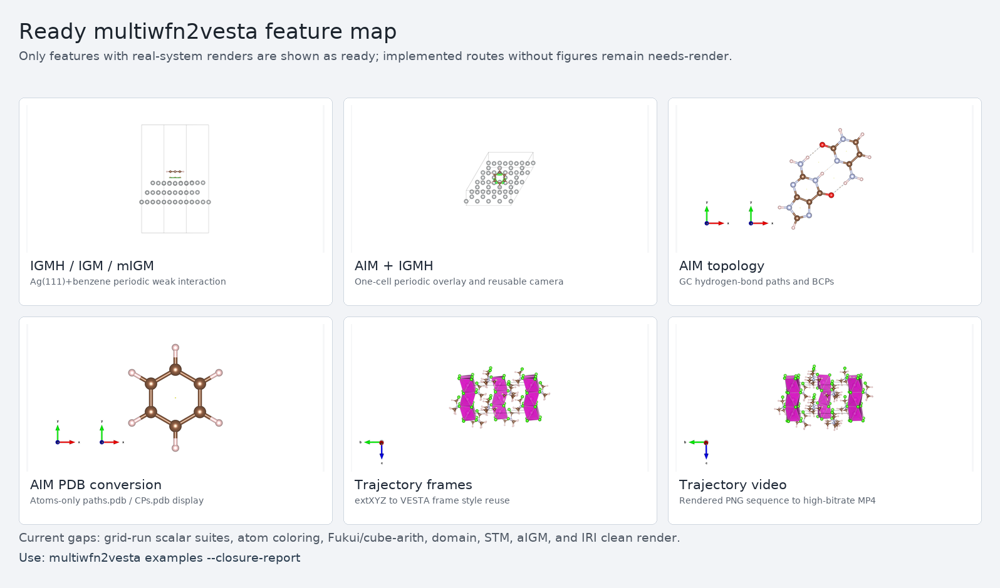
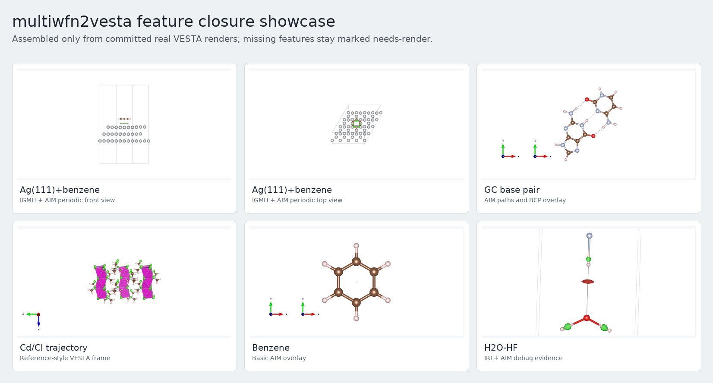

# multiwfn2vesta 中文手册

本手册面向实际使用：从 ABACUS 或 Multiwfn 结果出发，把波函数分析、cube、AIM/IGM/IRI 等结果整理成
VESTA 可打开、可渲染、可复用视角的文件。当前项目仍是实验性工具，但推荐统一入口已经收敛到
`multiwfn2vesta`。

## 1. 基本入口

在仓库内使用：

```bash
cd /mnt/g/work/multiwfn2vesta/project
export PATH=/mnt/g/work/multiwfn2vesta/project/bin:$PATH
multiwfn2vesta --help
multiwfn2vesta tools --lang zh
multiwfn2vesta tools interactive --lang zh
multiwfn2vesta examples --summary
multiwfn2vesta examples --closure-report
multiwfn2vesta examples
```

也可以 editable 安装：

```bash
pip install -e .
multiwfn2vesta --help
```

不要在 `src/multiwfn2vesta/` 目录里直接运行 `python -m aim_igmh_vesta` 这类模块。需要脚本化时使用：

```bash
multiwfn2vesta <command> [options]
```

普通用户优先用稳定 tools 层。这里只列出已经有本地测试、已提交样例，或用户明确认可可用的功能：

```bash
multiwfn2vesta tools --lang zh
multiwfn2vesta tools run esp-surface -- chg.cube potes.cube esp_products --axis z --tex-physical -0.08 0.08
multiwfn2vesta tools run excitation-bridge -- OUT.lr h2o_singlet.excit.txt --label singlet
multiwfn2vesta tools run trajectory-video -- png_frames movie.mp4 --bitrate 20M --run
```

`tools interactive` 是数字菜单式交互：先选功能编号，再逐项询问输入文件、输出
文件/目录和常用参数，最后显示将使用的参数并确认是否执行。

底层命令仍然保留给调试和脚本复用，例如 `cube-preset`、`abacus-esp-align`、
`abacus-lr-to-multiwfn`、`aim-igmh`、`trajectory-frames`。如果只是想完成常见任务，
先看 `tools`，不要从长命令列表里硬找。

从零到第一张图建议走这条顺序：

1. 运行 `multiwfn2vesta discover`，确认当前 Multiwfn 和 VESTA 候选路径。
2. 运行 `multiwfn2vesta examples --summary`，先看 ready/needs-render/needs-example 的数量、当前可用效果图和下一批优先体系。
3. 运行 `multiwfn2vesta examples --closure-report`，看每个功能当前是 `ready`、`linked`、`needs-render` 还是 `needs-example`。
4. 运行 `multiwfn2vesta examples --status ready`，只看已经有真实体系和效果图的算例。
5. 运行 `multiwfn2vesta examples --coverage`，按功能查推荐体系、runbook、效果图和缺口。
6. 运行 `multiwfn2vesta examples --id ag111_benzene_igmh_aim --verify`，检查项目内 runbook 和 gallery 图是否齐全。
7. 打开对应 `examples/<example_id>/README_zh.md`，先复用已有命令和输出目录。
8. 若只是查看效果，直接看 `docs/assets/gallery/` 下的 PNG；若要复跑，则按 runbook 重新生成 `.cub`、`.vesta`、recipe 和可选 PNG/MP4。

目前最适合先看的三个 ready examples 是：

- `ag111_benzene_igmh_aim`：ABACUS LCAO Molden -> Multiwfn IGMH/AIM -> VESTA 三视图。
- `gc_aim`：GC 碱基对 AIM 键径和 BCP 叠图。
- `cdcl_trajectory_video`：Cd/Cl 轨迹帧、Boundary/成键判据和高码率视频合成。

## 2. 先检查 Multiwfn 和 VESTA

```bash
multiwfn2vesta discover
```

Multiwfn 查找顺序是显式参数、环境变量、工作区工具、`PATH`。常见环境变量包括：

- `MULTIWFN_PATH`
- `MULTIWFNPATH`
- `MultiwfnPATH`
- `Multiwfnpath`
- `MULTIWFN_EXECUTABLE`

VESTA 查找顺序同理，常见环境变量包括：

- `VESTA_PATH`
- `VESTA_DIR`
- `VESTAPATH`
- `VestaPATH`
- `VESTA_EXECUTABLE`

大部分命令只写 `.vesta` 文件，不启动 VESTA；只有显式渲染三视图或图片时才会调用 VESTA。

## 3. 查看已有算例和效果图

推荐先看 curated examples：

```bash
multiwfn2vesta examples
multiwfn2vesta examples --summary
multiwfn2vesta examples --closure-report
multiwfn2vesta examples --status ready
multiwfn2vesta examples --status needs-work
multiwfn2vesta examples --id cdcl_trajectory_video
multiwfn2vesta examples --coverage
multiwfn2vesta examples --needs-render
multiwfn2vesta examples --command grid-run
multiwfn2vesta examples --gallery-assets
multiwfn2vesta examples --systems
multiwfn2vesta examples --verify
multiwfn2vesta examples --id cdcl_trajectory_video --verify-smoke
```

`--verify` 只检查项目内已提交的 runbook 和 gallery 图片是否存在，不要求本机必须有完整 `smoke/`
历史目录。`--id` 可以只看一个算例；`--verify-smoke` 会检查工作区本地 `smoke/` 证据，例如高码率
mp4、PNG 序列或中间 VESTA frame，这些大文件默认不提交。需要程序读取时可以用：

```bash
multiwfn2vesta examples --json
multiwfn2vesta examples --coverage --json
multiwfn2vesta examples --summary --json
multiwfn2vesta examples --closure-report --json
multiwfn2vesta examples --command aim-igmh --json
multiwfn2vesta examples --gallery-assets --json
```

`--coverage` 的粒度是功能，而不是单个体系。它会回答某个 CLI 命令现在应该用什么体系演示、
有没有手册级 PNG、缺的是渲染还是缺真实体系。只想看还没闭环的功能时用：

```bash
multiwfn2vesta examples --needs-render
```

如果已经知道要用哪个功能，直接按命令筛选：

```bash
multiwfn2vesta examples --command aim-igmh
multiwfn2vesta examples --command grid-run
multiwfn2vesta examples --command trajectory-video
```

如果目标是准备新 example，先看推荐真体系：

```bash
multiwfn2vesta examples --systems
```

这些体系的选择依据单独记录在 [真实算例体系选择依据](research/valuable_systems_for_examples_zh.md)。

当前推荐体系的取舍是：

- Ag(111)+benzene：周期性 ABACUS LCAO Molden 主线，适合 IGMH/AIM、vdW、ESP、电场、后续 steric/SBL。
- GC 碱基对：AIM 氢键拓扑已经 ready，适合继续补 IRI/RDG、RoSE/SEDD、surface extrema。
- benzene dimer 或取代芳香二聚体：适合弱相互作用标量场、vdW、Fukui/dual descriptor 的轻量教程。
- H2O-HF：保留为快速 IRI/AIM 调试体系，暂不作为最终手册主图。
- COF_12000N2 单层：适合 ABACUS direct cube、电子密度、静电势、ELF/LOL、原子电荷染色。
- open-shell/磁性体系：用于 spin density、Mulliken magnetism 和 atom value coloring。
- Cd/Cl 轨迹：用于 trajectory frame、Boundary、成键判据和高码率视频。

如果目标是“某个功能该看哪个 example”，优先用下面的 planned runbook。它们已经进
`multiwfn2vesta examples --status needs-work`，但没有真实 PNG 前不会标成 `ready`：

| 功能组 | example id | 当前定位 |
| --- | --- | --- |
| Ag 表面吸附的 ESP/vdW/steric/SBL/STM | `ag111_benzene_extended_fields` | 复用 Ag(111)+benzene IGMH+AIM 三视图相机 |
| IRI/RDG/DORI/RoSE/SEDD/on-top pair density | `benzene_dimer_scalar_suite` | 弱相互作用标量场主 planned example |
| 信息论/Ghosh/Renyi/USI/BNI 标量诊断 | `benzene_dimer_scalar_suite` / `gc_weak_interaction_suite` / `ag111_benzene_extended_fields` | 先作为高级 `grid-run` planned render，不标 ready |
| bonding/energy/anisotropy 诊断 | `benzene_dimer_scalar_suite` / `gc_weak_interaction_suite` / `ag111_benzene_extended_fields` | shape function、bond metallicity、局域能量密度、SCI/stiffness 等先作为 `needs-render` planned render |
| GC AIM 扩展到 IRI/ESP/extrema/on-top pair density | `gc_weak_interaction_suite` | 在已 ready 的 GC AIM 上继续补图 |
| ABACUS direct cube | `cof_direct_cube_suite` | COF 单层 density/potential/ELF 等 |
| Fukui/dual descriptor/cube-arith/原子反应性染色 | `fukui_dual_reactivity` | 需要中性/阳离子/阴离子同网格 cube |
| spin density/Mulliken magnetism/atom value coloring | `spin_atom_coloring_suite` | 替换 toy coloring smoke |
| domain-run 和基础 density/ESP/KED baseline | `h2o_domain_baseline` | 快速小分子回归图 |
| aIGM/amIGM trajectory average | `short_aigm_trajectory` | 和 Cd/Cl 几何轨迹视频互补 |

如果只想看当前已经提交到项目里的效果图：

```bash
multiwfn2vesta examples --gallery-assets
```

如果想一次性看“功能 -> 推荐体系 -> 效果图状态 -> 下一步”的闭环报告：

```bash
multiwfn2vesta examples --closure-report
```

对应的中文文档是 [功能闭环报告](feature_closure_report_zh.md)。它比 example 级
`ready/needs-work/misc` 更适合判断功能完成度，因为一个 example 可能是 `needs-work`，
但其中某条子功能已经被别的 ready workflow 间接覆盖；也可能有调试图但仍不能算 ready。

上述查询命令不会启动 VESTA；除非显式使用 `--verify-smoke`，也不会检查大体积 `smoke/` 文件。
`--gallery-assets` 只列出项目内轻量 PNG。

当前用于手册快速预览的闭环总览图是：



当前用于手册快速预览的 6-panel 展示图是：



这张图由已经提交的真实 VESTA PNG 拼接而成，不代表额外的新计算；仍缺手册级图的功能会继续在
`multiwfn2vesta examples --needs-render` 和 `docs/feature_examples_zh.md` 中标为待渲染。

## 4. 推荐工作流总览

| 起点 | 推荐命令 | 产物 | 典型用途 |
| --- | --- | --- | --- |
| ABACUS LCAO 计算目录 | `abacus-molden` | Multiwfn 可读 Molden | AIM、IGMH、IRI、grid-run、STM |
| ABACUS LR-TDDFT 输出目录 | `abacus-lr-to-multiwfn` | Multiwfn plain text 激发组态 | Multiwfn 主功能 18 的 hole/electron、transition density、NTO |
| ABACUS `chg.cube` + `potes.cube` | `abacus-esp-align` + `cube-preset esp` | vacuum-zero ESP cube + `.vesta` | COF/slab 范德华表面静电势染色 |
| ABACUS/Multiwfn cube | `cube-vesta` / `cube-preset` | `.vesta` + recipe | 密度、势、ELF、轨道、弱相互作用等值面 |
| Multiwfn 可读波函数 | `grid-run` | scalar cube + `.vesta` | density、orbital、ESP、KED、ELF/LOL、vdW、FOD 等 |
| neutral/anion/cation 波函数 | `fukui-run` | Fukui/dual cube + `.vesta` | 反应性区域 |
| 已有多个 cube | `cube-arith` | 线性组合 cube + `.vesta` | density difference、spin density、dual descriptor |
| 波函数 + fragment | `igmh-run` / `igm-run` / `migm-run` | `dg_inter.cub` + `sl2r.cub` + `.vesta` | 弱相互作用和片段相互作用 |
| 轨迹 + fragment | `aigm-run` / `amigm-run` | averaged IGM cubes + `.vesta` | 动力学平均弱相互作用 |
| XYZ/extXYZ 轨迹 | `trajectory-frames` | per-frame `.vesta` + manifest + recipe | 不启动 VESTA 的轨迹 frame 生成 |
| 已渲染 PNG 轨迹帧 | `trajectory-video` | ffmpeg frame list + mp4 + recipe | VESTA 轨迹视频合成 |
| 波函数 | `iri-run` | IRI/RDG cube pair + `.vesta` | NCI/IRI 弱相互作用 |
| 波函数 | `aim-run` | `paths.pdb`/`CPs.pdb` + `.vesta` | AIM 键径和临界点 |
| 已有 AIM PDB | `aim-pdb` | atoms-only AIM `.vesta` | 防止 VESTA 自动画大量 bond |
| 已保存 AIM+IGMH 叠图 | `aim-igmh` | styled `.vesta`，可选三视图 PNG | 周期体系相互作用图 |
| VESTA + 原子标量表 | `abacus-mulliken-color` / `multiwfn-atom-color` | colored `.vesta` | 电荷/磁矩/原子 Fukui 值染色 |

## 5. ABACUS 到 Multiwfn

ABACUS 需要 LCAO、单 Gamma/单 k、`nspin=1/2`，并输出 LCAO 波函数。推荐用最新 ABACUS
`tools/molden/molden.py`，项目命令会自动回退到旧版
`interfaces/Multiwfn_interface/molden.py` 并记录来源。

```bash
multiwfn2vesta abacus-molden abacus_calc ABACUS_Multiwfn.molden
multiwfn2vesta molden-check ABACUS_Multiwfn.molden --abacus
```

ABACUS 伪势体系必须保留 `[Nval]`，这样 Multiwfn 看到的是有效价电子核电荷，而不是全电子原子序数。

电子激发分析还需要 ABACUS LR-TDDFT 的激发组态文件。Molden 只提供参考波函数；
进入 Multiwfn 主功能 18 前，需要把 ABACUS 的 `Excitation_Energy_*` 和
`Excitation_Amplitude_*` 转成 plain text：

```bash
multiwfn2vesta abacus-lr-to-multiwfn OUT.lr h2o_singlet.excit.txt \
  --label singlet \
  --coeff-threshold 0.01
```

第一版只维护单 rank、Gamma-only、LCAO、限制性 singlet/triplet 风格输出。
`nocc/nvirt` 会优先从 ABACUS LR 日志和输入自动推断，推断失败时再显式传
`--nocc/--nvirt`；多 rank amplitude 默认拒绝，避免把
分布式 LR 向量错误拼接。
默认会用 `--coefficient-scale 0.7071067811865475` 把 ABACUS LR 振幅缩放到
Multiwfn 闭壳层 TDDFT 分析的归一化约定；若要写原始振幅，可显式设为 `1.0`。

离线 sample 可直接检查格式：

```bash
multiwfn2vesta abacus-lr-to-multiwfn \
  examples/abacus_lr_tddft_excitation_bridge/sample_lr \
  examples/abacus_lr_tddft_excitation_bridge/sample_lr/h2o_singlet.excit.txt \
  --label singlet --coeff-threshold 0.05
```

ABACUS 静电势范德华表面染色流程：

```bash
multiwfn2vesta abacus-esp-align OUT.cof12000n2_esp/potes.cube products/potes_vacuum0.cube \
  --axis z --vacuum-side high --vacuum-fraction 0.10 \
  --profile-csv products/potes_profile.csv \
  --report-md products/potes_alignment.md

multiwfn2vesta cube-preset esp OUT.cof12000n2_esp/chg.cube products/esp_surface \
  --texture-cube products/potes_vacuum0.cube \
  --isosurface 0.001 \
  --tex-physical -0.08 0.08 \
  --tex-range-source surface-band \
  --structure crystal
```

可离线检查的小 cube sample 在 `examples/cof_direct_cube_suite/sample_esp/`。

## 6. Cube 到 VESTA

最通用入口：

```bash
multiwfn2vesta cube-vesta density.cub cube_products --isosurface 0.01
```

带正负号的轨道/差分/dual descriptor：

```bash
multiwfn2vesta cube-vesta orbital.cub cube_products \
  --surface-mode signed \
  --isosurface 0.02
```

表面 cube + 染色 cube：

```bash
multiwfn2vesta cube-vesta IRI2_surface.cub cube_products \
  --texture-cube IRI1_color.cub \
  --isosurface 1.0 \
  --tex-physical -0.04 0.04 \
  --tex-range-source surface-band
```

常见分析优先用预设：

```bash
multiwfn2vesta cube-preset --list-presets
multiwfn2vesta cube-preset igmh dg_inter.cub products --texture-cube sl2r.cub
multiwfn2vesta cube-preset elf ELF.cub products
multiwfn2vesta cube-preset vdw-potential vdWpot.cub products
```

## 7. Multiwfn grid-run

`grid-run` 驱动 Multiwfn 主功能 `5`，从波函数生成一个实空间函数 cube，然后可选接 VESTA preset：

```bash
multiwfn2vesta grid-run input.molden grid_products \
  --function density \
  --grid-points 80 80 80 \
  --timeout 300
```

列出当前维护函数：

```bash
multiwfn2vesta grid-run --list-functions
```

高价值函数建议：

- `density`, `orbital`, `orbital-density`
- `spin-density`, `spin-polarization`, `alpha-density`, `beta-density`
- `laplacian`, `hamiltonian-ked`, `lagrangian-ked`, `thomas-fermi-ked`, `weizsacker-ked`, `pauli-ked`
- `lagrangian-minus-weizsacker-ked`, `tf-minus-weizsacker-ked`, `tf-minus-lagrangian-ked`, `weizsacker-minus-lagrangian-ked`
- `tf-lagrangian-ked-absdiff`, `weizsacker-lagrangian-ked-absdiff`, `lagrangian-local-temperature`, `tf-local-temperature`
- `thomas-fermi-ked-potential`, `gea2-ked-potential`, `tfvw-ked-potential`
- `elf`, `lol`
- `esp`, `electron-esp`, `positive-esp`, `negative-esp`, `electric-field-magnitude`
- `alie`, `local-electron-affinity`, `local-electron-attachment-energy`
- `vdw-potential`, `vdw-repulsion-potential`, `vdw-dispersion-potential`
- `iri`, `rdg`, `dori`
- `rose`, `sedd`
- `fod`, `orbital-weighted-fukui-plus/minus/zero`, `orbital-weighted-dual-descriptor`
- `information-gain-density`, `shannon-entropy-density`, `fisher-information-density`, `ghosh-entropy-density`, `renyi-quadratic-density`, `disequilibrium-density`
- `usi`, `bni`
- `shape-function`, `average-local-electrostatic-potential`, `potential-energy-density`, `energy-density`, `scaled-energy-density`
- `lagrangian-ked-per-electron`, `bond-metallicity`, `dimensionless-bond-metallicity`, `energy-density-per-electron`
- `energy-density-gradient-norm`, `energy-density-laplacian`
- `momentum-fluctuation-magnitude`, `electron-density-ellipticity`, `eta-index`, `modified-eta-index`, `sci`, `stiffness`
- `becke`, `hirshfeld`, `hirshfeld-delta-g`
- `pair-function`, `source-function`

若要把生成的属性 cube 映射到已有 density/surface cube：

```bash
multiwfn2vesta grid-run input.molden esp_map \
  --function esp \
  --surface-cube density.cub \
  --grid-mode cube \
  --grid-cube density.cub \
  --tex-physical -0.05 0.05
```

若只想看电子贡献 ESP、ESP 的正/负区域或电场强度，不需要手工改 Multiwfn
`settings.ini`，直接用命名路由：

```bash
multiwfn2vesta grid-run input.molden esp_components --function electron-esp
multiwfn2vesta grid-run input.molden esp_components --function positive-esp
multiwfn2vesta grid-run input.molden esp_components --function negative-esp
multiwfn2vesta grid-run input.molden efield --function electric-field-magnitude
multiwfn2vesta grid-run input.molden slow_electron --function rose
multiwfn2vesta grid-run input.molden sedd_field --function sedd
multiwfn2vesta grid-run input.molden steric --function steric-potential
multiwfn2vesta grid-run input.molden sbl --function sbl-total-potential
multiwfn2vesta grid-run input.molden sbl_force --function sbl-total-force-magnitude
multiwfn2vesta grid-run input.molden ontop_pair --function on-top-pair-density --pair-correlation-type 3
multiwfn2vesta grid-run input.molden info_gain --function information-gain-density
multiwfn2vesta grid-run input.molden ghosh --function ghosh-entropy-density
multiwfn2vesta grid-run input.molden renyi2 --function renyi-quadratic-density
multiwfn2vesta grid-run input.molden usi --function usi
multiwfn2vesta grid-run input.molden bni --function bni
multiwfn2vesta grid-run input.molden shape --function shape-function
multiwfn2vesta grid-run input.molden avg_esp --function average-local-electrostatic-potential
multiwfn2vesta grid-run input.molden energy_density --function energy-density
multiwfn2vesta grid-run input.molden energy_density_gradient --function energy-density-gradient
multiwfn2vesta grid-run input.molden energy_density_laplacian --function energy-density-laplacian
multiwfn2vesta grid-run input.molden bond_metallicity --function bond-metallicity
multiwfn2vesta grid-run input.molden sci --function sci
```

这些命名路由都走 Multiwfn 函数 `100`，分别写 run-local
`iuserfunc=14/101/102/103`、RoSE/SEDD 的 `iuserfunc=18/19`，或 steric/SBL 相关
`iuserfunc=40-43/60-69/-69/110-113`，以及 on-top pair density 的
`iuserfunc=36`，不会修改全局 Multiwfn 配置。`electron-esp`
调用 Multiwfn 源码中的 `eleesp(x,y,z)`，即电子贡献静电势，通常按单负
`-0.05` a.u. 等值面显示；正/负 ESP 分量适合在极性分子、吸附界面或电荷转移
体系中快速分开看静电正负区域；电场强度适合看局域强场区域。若要映射到 density
surface 上，再加
`--surface-cube density.cub --tex-physical MIN MAX`。
RoSE 用 `(Dh-G)/(Dh+G)` 描述慢电子区域，SEDD 用 `log(1+epsilon)` 描述单指数衰减偏离；
两者当前已有 CLI 和 VESTA preset，但还缺真正适合手册的效果图。后续优先用 benzene dimer、
GC 碱基对或类似弱相互作用/芳香体系生成 paired figure，而不是 toy cube。

Steric/SBL 路线适合看吸附界面、分子间排斥/束缚区域和能量分解诊断：

- `steric-energy-density`, `steric-potential`, `steric-charge`,
  `steric-force-magnitude`
- `pauli-potential`, `pauli-force-magnitude`, `pauli-charge`
- `quantum-potential`, `quantum-force-magnitude`, `quantum-charge`
- `electrostatic-force-magnitude`, `electrostatic-charge`
- `sbl-electrostatic-energy-density`, `sbl-quantum-energy-density`,
  `sbl-quantum-energy-density-lagrangian`
- `sbl-total-energy-density`, `sbl-total-potential`,
  `sbl-total-force-magnitude`, `sbl-total-charge`

这些路线都导出 `userfunc.cub`。默认 standalone VESTA preset 分为
`steric-energy-density`、`sbl-energy-density`、`sbl-potential`、
`sbl-force-magnitude` 和 `sbl-charge`；如果提供 `--surface-cube`，则作为 texture
映射到已有 density/interaction surface。默认等值面只是起点，正式出图前要看 cube
最小/最大值并调 `--isosurface` 或 `--tex-physical`。

`on-top-pair-density` 也导出 `userfunc.cub`。Multiwfn 源码中 `iuserfunc=36`
会在同一点取 `r1=r2` 的全电子 pair density，并临时使用 `pairfunctype=12`；
因此它不需要 `pair-function` 所需的 reference point。`--pair-correlation-type`
仍然会写 run-local `paircorrtype`：`1` 为 exchange only，`2` 为 Coulomb
correlation only，`3` 为两者都包含。默认 VESTA preset 是单正值
`on-top-pair-density`，等值面 `0.01` 只是起点；正式图建议用 benzene dimer
或 GC 碱基对，先检查 cube 范围。

信息论和相互作用指标路线也走 function `100`。维护态命名路线包括：

- `information-gain-density` / `relative-shannon-entropy`: `iuserfunc=49`，会先执行 Multiwfn `1000 -> 17` 初始化 promolecular reference，再用 signed preset。
- `shannon-entropy-density`: `iuserfunc=50`，signed preset。
- `fisher-information-density` / `phase-space-fisher-information-density`: `iuserfunc=51/70`，单正值 preset。
- `second-fisher-information-density`: `iuserfunc=52`，源码为 `-Laplacian(rho)*log(rho)`，可带符号，使用 signed preset。
- `ghosh-entropy-density` / `ghosh-entropy-density-laplacian-corrected`: `iuserfunc=53/54`，单正值 preset。
- `renyi-quadratic-density` / `renyi-cubic-density`: `iuserfunc=55/56`，即 `rho^2` / `rho^3` 型 Renyi integrand，单正值 preset。
- `disequilibrium-density` / `semi-similarity`: `iuserfunc=100`，单正值 preset。
- `usi`: `iuserfunc=819`，`laplacian(rho)/rho^(5/3)`，signed preset。
- `bni`: `iuserfunc=820`，`(tau-tau_w)/tau_w`，单正值 preset。

这些路线都有 CLI、preset 和测试，但还没有手册级真实 PNG。推荐先用 benzene/phenol dimer 或 GC
碱基对做弱相互作用示例，USI/BNI 也可放到 Ag(111)+benzene 吸附界面；正式出图必须记录 cube
最小/最大值、等值面和是否映射到 density/interaction surface。

bonding/energy diagnostics 也是 function `100` 命名路线，当前已有 CLI、preset 和测试，但还没有
手册级真实 PNG。维护态路线包括：

- `shape-function`: `iuserfunc=9`，`rho/N` 型 density-like shape function，单正值 preset。
- `average-local-electrostatic-potential`: `iuserfunc=8`，`totesp/rho`，signed preset；低密度区可能尖锐。
- `potential-energy-density` / `energy-density` / `scaled-energy-density` /
  `local-nuclear-attraction-energy-density`: `iuserfunc=10/11/-11/12`，signed energy-density preset。
- `lagrangian-ked-per-electron` / `energy-density-per-electron`: `iuserfunc=13/17`，signed local-energy-per-electron preset；
  `G(r)/rho(r)` 在 BCP 附近可辅助区分共价和闭壳层相互作用。
- `bond-metallicity` / `dimensionless-bond-metallicity`: `iuserfunc=15/16`，signed preset；Laplacian 分母附近要谨慎。
- `momentum-fluctuation-magnitude`: `iuserfunc=25`，单正值 preset。
- `energy-density-gradient-norm`: `iuserfunc=79`，源码调用 `energydens_grdn(x,y,z)`，即能量密度梯度范数；单正值 preset。
- `energy-density-laplacian`: `iuserfunc=80`，源码调用 `energydens_lapl(x,y,z)`，由能量密度梯度有限差分得到；signed preset。
- `electron-density-ellipticity`, `eta-index`, `modified-eta-index`: `iuserfunc=30/31/32`，用于密度各向异性诊断。
- `sci`: `iuserfunc=37`，Multiwfn 源码调用 `ELF_LOL(...,"SCI")`，作为强共价相互作用指标显示。
- `stiffness`: `iuserfunc=115`，源码调用 `densellip(...,3)`，单正值 stiffness preset。

这组功能优先用 benzene/phenol dimer 或 GC 碱基对做分子间相互作用/BCP 附近对照；Ag(111)+benzene
可用于界面 metallicity、局域能量密度或 stiffness。正式图必须先记录 cube range，再调
`--isosurface` 或通过 `--surface-cube` 映射到统一的 density/interaction surface。
能量密度梯度范数和能量密度拉普拉斯也归在这一组：它们适合看 BCP 附近、金属-分子界面或 COF 孔边缘的
能量密度变化，但数值导数场通常比原始能量密度更尖锐，第一张正式图建议先从 GC 碱基对或
benzene/phenol dimer 的小范围网格开始，再推广到 Ag(111)+benzene。

扩展 KED diagnostics 也走 function `100` 和 run-local `-set`，不会改全局
`settings.ini`：

```bash
multiwfn2vesta grid-run input.molden ked_diff --function tf-minus-lagrangian-ked
multiwfn2vesta grid-run input.molden ked_abs --function tf-lagrangian-ked-absdiff
multiwfn2vesta grid-run input.molden ked_temp --function lagrangian-local-temperature --ked-density-cutoff 1e-6
multiwfn2vesta grid-run input.molden ked_pot --function thomas-fermi-ked-potential
multiwfn2vesta examples --command local-temperature-ked
```

源码证据对应为：`iuserfunc=1201` 是 selected KED minus Weizsacker KED，
`1202` 是 selected KED minus Lagrangian KED，`1203` 是 selected KED 与
Lagrangian KED 的绝对差，`1204` 是 KED-derived local temperature，`1210`
是 KED potential。当前只维护 `1210` 中源码显式处理的 `iKEDsel=3/5/7`
路线，即 Thomas-Fermi、second-order GEA 和 Thomas-Fermi+Weizsacker。
维护态 function-100 KED 路线默认都会在 run-local settings 里写 `uservar=0`，
避免继承 Multiwfn 安装目录 `settings.ini` 里的旧值。`--ked-density-cutoff`
只对 local-temperature 路线开放，会把这个 run-local `uservar` 覆盖为用户值；
源码里非零 `uservar` 也参与 KED 评价，所以它只能作为谨慎的稳定性参数，正式出图必须记录数值和 cube 范围。

## 8. AIM、IRI、IGMH 的组合图

单独 AIM：

```bash
multiwfn2vesta aim-run input.molden aim_out
multiwfn2vesta aim-pdb aim_out/paths.pdb aim_atoms_only.vesta --cps-pdb aim_out/CPs.pdb
```

单独 IRI：

```bash
multiwfn2vesta iri-run input.molden iri_products --timeout 300
```

IGMH：

```bash
multiwfn2vesta igmh-run input.molden igmh_products \
  --fragment 1-48 \
  --fragment 49-60 \
  --grid-mode spacing \
  --grid-spacing 0.25
```

已有 AIM+IGMH 叠图的样式化和三视图：

```bash
multiwfn2vesta aim-igmh input_overlay.vesta products \
  --label-bcp-sites \
  --render-three-views \
  --initial-view top \
  --extra-rotate top x -8 \
  --scale 2
```

经验规则：

- AIM 键径点作为 pseudo-atom 画，不要给 AIM phase 画 bond。
- BCP 单独拆到最后一个 phase 更容易显示。
- 结构 phase 保留正常 bond；AIM phase 的 `SBOND` 清空。
- IGMH/IRI 的 section plane 通常关闭。
- 三视图应从同一个 `.vesta` 一次载入后旋转导出，而不是改三份坐标。

## 9. 真实效果图

当前已整理的效果图库见：

- `docs/example_gallery_zh.md`
- `docs/assets/gallery/`

重点示例：

- Ag(111)+benzene IGMH+AIM 三视图
- GC 碱基对 / benzene AIM overlay
- Cd/Cl NVT 轨迹视频 poster frame 和高码率 mp4 记录
- H2O-HF IRI+AIM 调试证据
- benzene NICS arrow 杂项

## 9.1 XYZ/extXYZ 轨迹生成 VESTA frame

`trajectory-frames` 是轨迹视频工作流的上游维护入口：读取标准 XYZ 或带 `Lattice="..."`
的 extXYZ，直接写逐帧 `.vesta` 文件、manifest 和 recipe。它不依赖 ASE，不启动 VESTA，也不渲染 PNG，
因此适合先批量生成结构帧，再在方便时用 VESTA 或其它渲染层导出图片。

Cd/Cl 最小 example：

```bash
multiwfn2vesta trajectory-frames examples/cdcl_trajectory_video/cdcl_tiny.extxyz \
  /tmp/cdcl_vesta_frames \
  --bond Cd Cl 0 3.5 \
  --boundary -0.05 1.05 -0.05 1.05 -0.05 1.05
```

常用选项：

- `--reference-vesta saved.vesta`: 复用已保存 VESTA 的 `SCENE`/`STYLE` 尾段，适合继承视角和显示风格。
- `--bond E1 E2 MIN MAX`: 写 VESTA `SBOND` 成键规则，可重复；Cd-Cl 轨迹常用 `0 3.5` 放宽判据。成键显示需要 `BONDS   1` 和非空 `SBOND` 同时存在。
- `--boundary XMIN XMAX YMIN YMAX ZMIN ZMAX`: 扩展周期显示范围，例如三个方向都用 `-0.05 1.05`。
- `--cell-vectors ...`: 普通 XYZ 没有 extXYZ `Lattice` 时手动给 9 个晶胞向量分量。
- `--stride N`: 只输出部分帧，便于先做预览。

`cube-vesta` / `cube-preset` 从 cube 原子表生成结构 phase 时，会按 1-118 号元素
covalent radius 表自动写默认 `SBOND` 元素对距离；`--structure-bonds-off` 只关闭
全局 `BONDS` 显示。轨迹和特殊配位体系仍可用 `--bond` 手工覆盖更合适的距离。

输出包括：

- `vesta/frame_0001.vesta` 等逐帧 VESTA 文件。
- `frame_trajectory_frames_manifest.json`: 记录源轨迹、帧序号、Boundary、bond rules 和参考 `.vesta`。
- `frame_trajectory_frames_recipe.md`: 记录下一步 PNG 渲染和 `trajectory-video` 合成提示。

当前限制：

- 还不直接读取 ASE `.traj`；如果只有 ASE `.traj`，先导出 XYZ/extXYZ。
- 还不启动 VESTA 渲染 PNG；这一步仍然单独维护，以免自动化窗口抢焦点。

## 9.2 已渲染轨迹帧合成视频

`trajectory-video` 只处理已经渲染好的 PNG 序列，不启动 VESTA，因此不会抢鼠标。默认只写 ffmpeg
frame list 和 recipe，并打印命令；只有加 `--run` 才真的执行 ffmpeg。

```bash
multiwfn2vesta trajectory-video png_frames trajectory.mp4 \
  --fps 24 \
  --bitrate 20M

multiwfn2vesta trajectory-video \
  --manifest examples/cdcl_trajectory_video/artifact_manifest.json \
  --output /tmp/cdcl_trajectory.mp4 \
  --fps 24 \
  --bitrate 20M
```

输出包括：

- `<output>_frames.txt`: ffmpeg concat 输入清单。
- `<output>_trajectory_video_recipe.md`: 帧数、首尾帧、编码参数和完整命令。
- `<output>.mp4`: 只有使用 `--run` 且 ffmpeg 成功时生成。

仍待维护的是 ASE `.traj` 直接读取和 VESTA PNG 自动渲染；XYZ/extXYZ 到 `.vesta` frame 的部分已经由
`trajectory-frames` 维护。

## 10. 每个功能的 example 状态

详见：

- `docs/example_status_matrix_zh.md`
- `docs/feature_examples_zh.md`

原则：

- 有真实 PNG/VESTA 的标为“已闭环”。
- 只有 cube/VESTA 但没有图片的标为“缺渲染”。
- 只有命令设计或单元测试的标为“缺真实体系”。
- 图已存在但不够适合手册展示的标为调试证据或待重调视角，不算完成。
- 暂不维护的 NICS/箭头作为 misc，不进入主功能完成度。

新增或补图一个功能时，建议按同一个闭环顺序执行：

1. 用 `multiwfn2vesta examples --command <功能名>` 查当前 example、体系和状态。
2. 如果状态是 `needs-example`，先补 `examples/<example_id>/README_zh.md`，不要先画 toy 图。
3. 如果状态是 `needs-render`，优先复用 Ag(111)+benzene、GC、benzene/phenol dimer、COF、Fukui 三态或 Cd/Cl 轨迹这些已记录的真实体系。
4. 跑 Multiwfn/ABACUS 时把大文件留在 `smoke/` 或本地计算目录，只把轻量 recipe、runbook 和精选 PNG 放进项目。
5. PNG 进入 `docs/assets/gallery/` 后，再把 `examples.py`、`feature_examples_zh.md`、`example_status_matrix_zh.md` 和本手册里的状态从 `needs-render` 升级。

## 11. 常见问题

### VESTA 抢鼠标

当前 Windows VESTA CLI 渲染仍可能抢焦点。写 `.vesta` 文件不需要启动 VESTA；只有 `--render-three-views`
这类显式渲染才会打开 VESTA。若正在使用电脑，建议先只生成 `.vesta`，稍后批量渲染。

### 看不到 IRI 颜色

检查 `--tex-physical` 和 `--tex-range-source surface-band`。VESTA 的 `TEX3P` 需要百分比，项目会把物理范围按
texture cube 的实际范围换算。若 cube 已经被裁剪，通常用 `--tex-physical -0.04 0.04`。

### BCP 看不见

优先用 `aim-igmh` 的默认拆分 BCP phase。不要移动 BCP 坐标来解决视角问题；先调视角、缩放、phase 顺序和半径。

### ABACUS Molden 不能读

先跑：

```bash
multiwfn2vesta molden-check ABACUS_Multiwfn.molden --abacus
```

重点检查 `[Cell]`、`[Atoms]`、`[GTO]`、`[MO]` 和 `[Nval]`。

### 某个功能还没有效果图

先在 `example_status_matrix_zh.md` 里找对应功能组。若状态是“缺渲染”或“缺真实体系”，不要直接用于展示型结果；
先补一个真实 smoke 目录、生成 VESTA，再导出 PNG。
