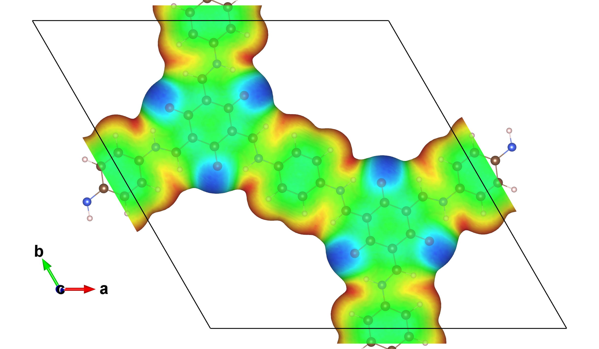
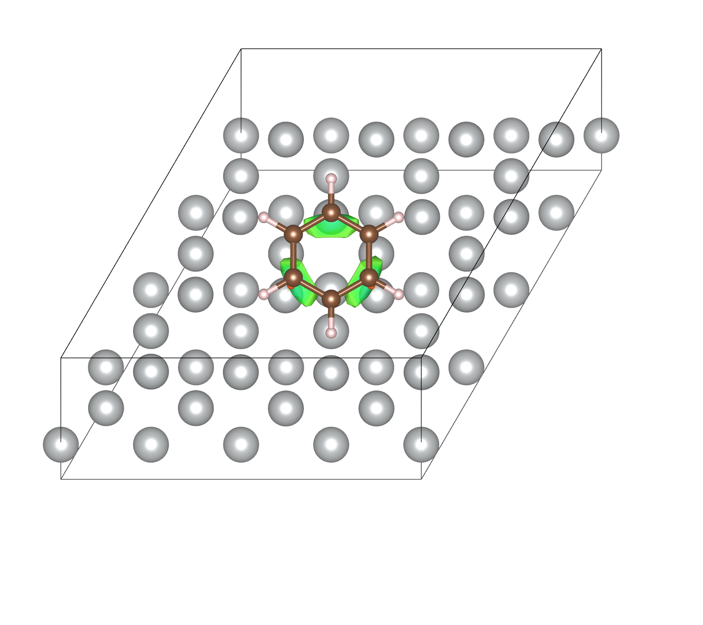
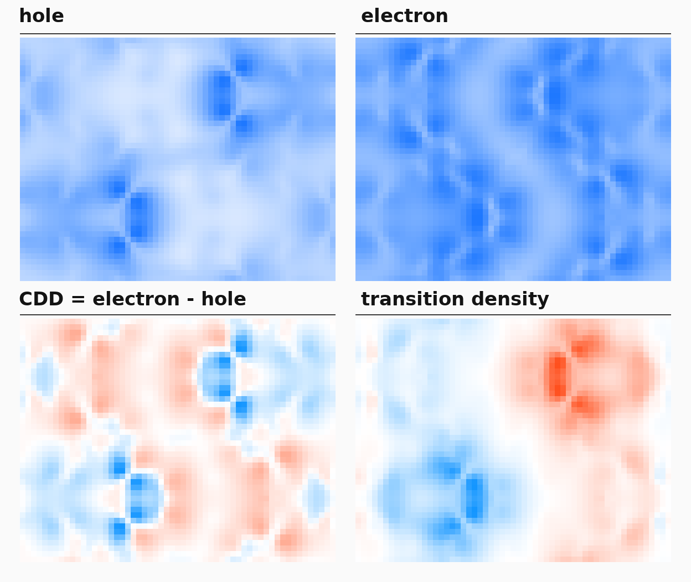
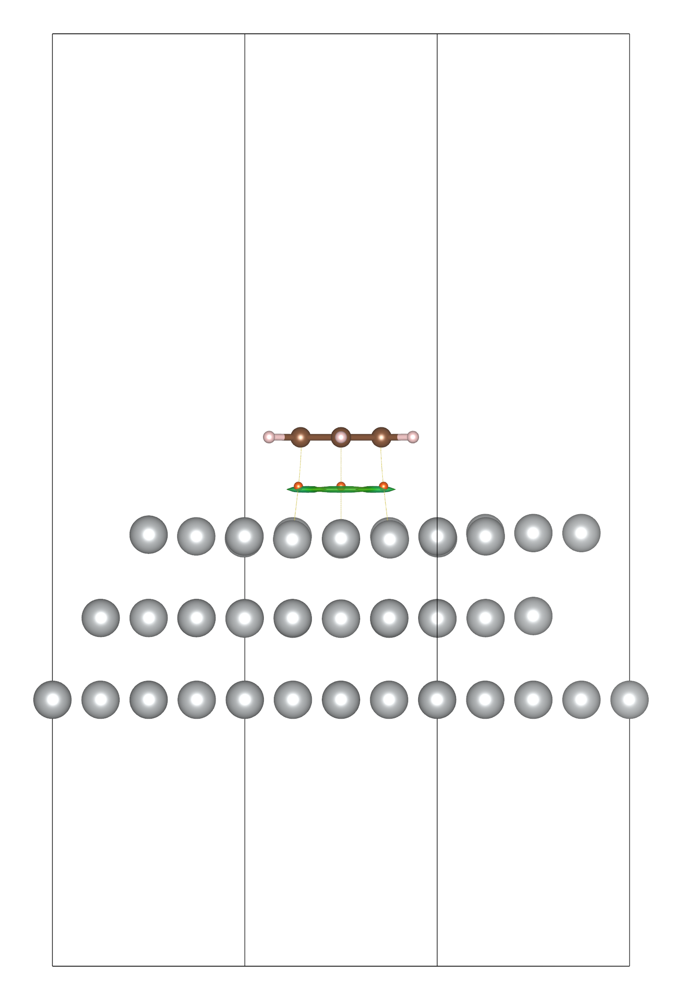
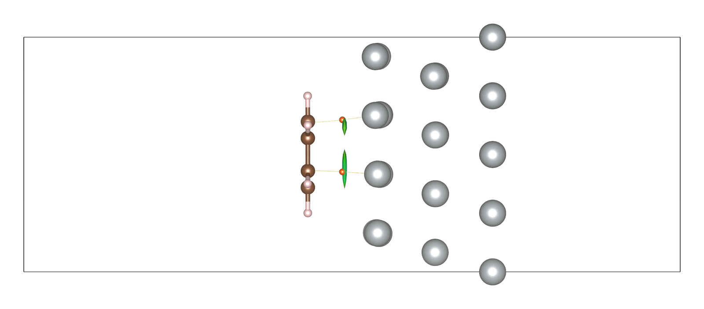
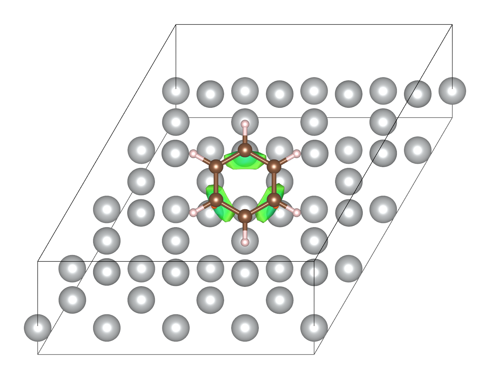
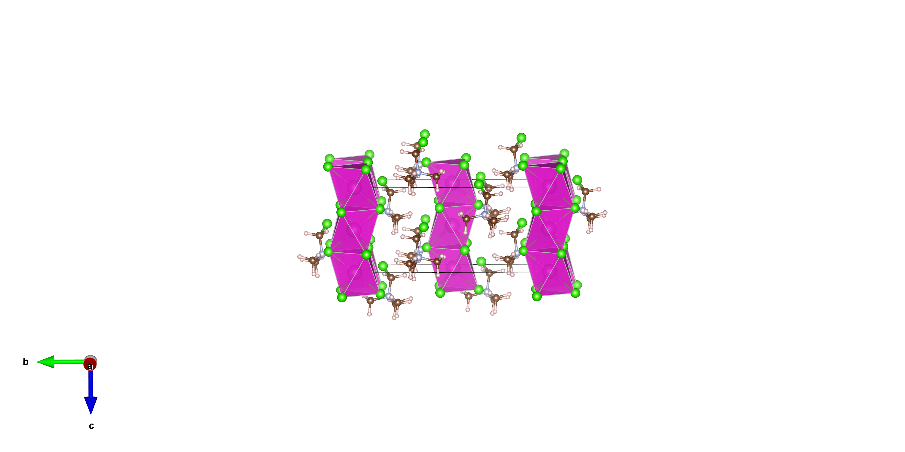

# 从第一性原理计算到可发表图片：ABACUS/CP2K + Multiwfn + VESTA/VMD 实用工作流

> 本文面向刚开始做周期体系波函数分析的读者。重点不是介绍某个程序的全部功能，而是讲清楚一条可迁移的工作流：第一性原理程序产生可信数据，Multiwfn 将数据变成有化学意义的分析结果，VESTA 或 VMD 把结果表达成容易检查和发表的图。

本文使用的命令和图片来自开源项目 [multiwfn2vesta](https://github.com/Stardust0831/multiwfn2vesta) 中已经实际跑过的案例。主线是 ABACUS + Multiwfn + VESTA，同时用 CP2K 的周期 TDDFT 案例说明电子-空穴分析，并讨论 VMD 什么时候更方便。

## 1. 先把四个程序的分工想清楚

很多初学者遇到的第一个困难，不是命令不会写，而是把“计算”“分析”和“画图”混成了一件事。比较稳妥的理解是：

```text
ABACUS / CP2K
    |  电子密度、静电势、轨道、波函数、激发组态
    v
Multiwfn
    |  ESP、IGMH、AIM、hole/electron、CDD、transition density 等
    v
cube / PDB / VESTA scene / VMD script
    |
    v
VESTA / VMD
    |  等值面、表面染色、周期复制、相机、三视图、轨迹和视频
    v
可检查、可复现、可发表的图片
```

- **ABACUS、CP2K**负责求解电子结构。它们输出的密度、势、轨道和激发信息是否可信，决定了后面所有图是否有意义。
- **Multiwfn**负责把原始电子结构转成化学问题。例如“苯和银表面之间哪里存在相互作用”“电子激发后电子从哪里离开、到哪里去”。
- **VESTA**擅长晶胞、周期边界、结构与三维格点数据的叠加，适合固体、表面、二维材料和统一风格的静态图。
- **VMD**擅长脚本、多个 representation、轨迹和快速交互，适合批量显示 cube、动画以及 Multiwfn 已生成 `.vmd` 脚本的场景。

因此，“VESTA 能否直接载入某个文件”并不等于“分析已经完成”。例如 VESTA 可以显示电子密度 cube，但它不会替你定义 IGMH 片段，也不会从 TDDFT 输出中构造空穴和电子。

## 2. 需要准备哪些文件

不同分析需要的数据不同。下面这张表很重要。

| 目标 | 最少需要什么 | 常见产物 |
| --- | --- | --- |
| 密度或静电势直接显示 | density/potential cube | `.cube`、`.vesta` |
| ESP 在电子密度表面染色 | density cube + electrostatic-potential cube | 真空归零 ESP cube、带 texture 的 `.vesta` |
| AIM、IGMH、IRI、轨道等波函数分析 | 含轨道、占据数、基组/轨道展开和晶胞的波函数文件 | Molden/MWfn、`paths.pdb`、`CPs.pdb`、`dg_inter.cub`、`sl2r.cub` |
| TDDFT 电子-空穴分析 | 参考波函数 + 激发能和组态系数 | `hole.cub`、`electron.cub`、`CDD.cub`、`transdens.cub` |
| 轨迹视频 | XYZ/extXYZ 轨迹，或已经渲染的 PNG 序列 | 每帧 `.vesta`、PNG、MP4 |

一个常见误区是：**只有 Molden 文件并不足以做电子-空穴分析**。Molden 提供参考轨道；Multiwfn 还需要知道每个激发态由哪些占据轨道到空轨道的跃迁组成，以及相应系数。

## 3. 用 multiwfn2vesta 统一入口

安装项目后可以先看稳定工具：

```bash
multiwfn2vesta tools --lang zh
multiwfn2vesta tools interactive --lang zh
```

第二条命令会显示类似 Multiwfn 的数字菜单，逐项询问输入和输出。检查外部程序位置可以用：

```bash
multiwfn2vesta discover
```

程序会从命令行参数、`MultiwfnPATH`/`MULTIWFN_PATH`、`VESTA_PATH`、工作区和 `PATH` 中寻找 Multiwfn、VESTA 等程序。建议实际发表工作中仍显式记录程序版本、输入文件和命令，不要只保留最终 PNG。

## 4. 波函数文件怎么产生

### 4.1 ABACUS：优先使用 LCAO 波函数路线

ABACUS 的直接 cube 输出适合密度、势和 ELF 等格点场；如果要让 Multiwfn 进一步计算 AIM、IGMH、IRI 或轨道相关函数，当前最实用的是 LCAO 波函数路线。

一个最小的 SCF 输入通常要包含：

```text
basis_type       lcao
gamma_only       1
out_wfc_lcao     1
```

然后用当前 ABACUS checkout 中可用的 Multiwfn Molden 转换脚本。`multiwfn2vesta` 会优先尝试 `tools/molden/molden.py`，找不到时回退到 `interfaces/Multiwfn_interface/molden.py`，并记录实际使用的源码位置：

```bash
multiwfn2vesta abacus-molden \
  abacus_calc \
  ABACUS_Multiwfn.molden \
  --with-Nval true

multiwfn2vesta molden-check \
  ABACUS_Multiwfn.molden \
  --abacus
```

这里的 `[Cell]` 和 `[Nval]` 很关键：

- `[Cell]` 告诉 Multiwfn 周期晶胞是什么，否则格点和周期复制容易出错。
- `[Nval]` 告诉 Multiwfn 赝势体系每种元素保留了多少价电子。没有它时，核电荷和电子数的解释可能不符合赝势计算。

目前这条路线最稳妥的范围是 LCAO、Gamma/single-k、`nspin=1/2`。SOC、多 k、复轨道和任意并行分布的 LR 振幅不能未经验证就直接套用。

### 4.2 CP2K：直接输出 MO_MOLDEN

CP2K 可以在 `&DFT / &PRINT` 中输出 Molden。现代版本可显式写晶胞：

```text
&PRINT
  &MO_MOLDEN ON
    FILENAME =system.molden
    NDIGITS 6
    NLUMO 50
    WRITE_CELL T
  &END MO_MOLDEN
&END PRINT
```

`NLUMO` 决定写入多少空轨道。做 TDDFT 激发态分析时，空轨道必须覆盖所有不可忽略的跃迁。越高的激发态通常越需要更多空轨道。旧版 CP2K 产生的 Molden 可能没有 `[Cell]`，应先检查并按 CP2K 输入中的晶胞补齐，而不是等到图形错位后再猜原因。

## 5. 案例一：COF 的 ESP 范德华表面染色

### 5.1 这个图表达什么

ESP 图不是把静电势随便画成一个等值面，而是：

1. 用电子密度的某个等值面近似分子或材料的外表面；
2. 把静电势作为颜色映射到这个表面上；
3. 观察电子富集、电子贫化以及可能的静电识别区域。

对分子常用 `rho=0.001 a.u.` 作为范德华表面的经验近似。对二维材料、COF 和表面体系，这仍是很有用的可视化约定，但它不是严格由范德华半径定义的几何表面。



图 1. 单层 COF 的 `rho=0.001 a.u.` 电子密度表面，颜色来自真空归零后的静电势。原子和成键同时显示。本图没有附 colorbar，只用于展示流程和空间分布；保存的 VESTA 场景采用手调并反转的色标，物理范围约为 `-0.08..0.08 a.u.`，正负颜色映射必须以实际 VESTA 色标为准。

### 5.2 ABACUS 输出

ABACUS 输入中启用：

```text
out_chg  1
out_pot  2
```

`out_chg` 给出电子密度；`out_pot 2` 给出 electrostatic potential。不同 ABACUS 版本中输出名可能是 `chg.cube`/`SPIN1_CHG.cube` 和 `potes.cube`/`ElecStaticPot.cube`，应以实际 `OUT.*` 目录为准。不要把 `out_pot 1` 的 total local potential 不加区分地当作 ESP，因为它还包含 XC 等势项。

### 5.3 为什么要把真空平台移到零

周期计算中的静电势整体加上一个常数不会改变电场，因此零点有任意性。对含真空层的 slab 或二维材料，最直观的处理是：

1. 沿表面法向做平面平均；
2. 找到足够平坦的真空平台；
3. 从整个 ESP cube 中减去真空平台平均值。

这样不同图之间的色标才更容易比较。本项目的 COF 实例沿 `z` 方向取高端 10% 真空层，减去约 `3.5137E-02` 的常数。

### 5.4 一条命令完成对齐和 VESTA 场景

```bash
multiwfn2vesta tools run esp-surface -- \
  SPIN1_CHG.cube \
  ElecStaticPot.cube \
  esp_products \
  --axis z \
  --vacuum-side high \
  --vacuum-fraction 0.10 \
  --isosurface 0.001 \
  --tex-physical -0.08 0.08 \
  --tex-range-source surface-band \
  --structure crystal \
  --boundary -0.05 1.05 -0.05 1.05 -0.05 1.05
```

命令会写出真空归零后的 ESP cube、平面平均 CSV、对齐报告、VESTA 文件和 recipe。`surface-band` 表示用接近目标密度表面的格点估计 texture 范围，避免 cube 内部极端值把表面颜色压成一片。

在相信图片之前至少检查两件事：

- 电子密度 cube 的体积分是否接近预期价电子数；
- 真空区 ESP 平面平均是否真的平坦。

这一步能发现单位、网格并行输出或文件处理错误。我们曾遇到过 ABACUS PW/GPU 多 MPI rank 生成异常 density cube 的情况；“VESTA 能打开”并不能证明数据正确。

## 6. 案例二：Ag(111) 吸附苯的 IGMH + AIM

### 6.1 为什么把两类分析叠在一起

IGMH 和 AIM 回答的问题不同：

- IGMH 的 `delta_g_inter` 等值面告诉我们片段之间**哪些空间区域存在明显相互作用**。
- 映射到表面的 `sign(lambda2)rho` 提供吸引、色散主导或排斥的经验性颜色线索。
- AIM 的键临界点 BCP 和键径提供电子密度拓扑路径，适合定位具体原子对之间的拓扑联系。

把两者叠加时，可以同时看到“大面积相互作用区域”和“离散拓扑路径”。但这并不意味着看到 BCP 就自动证明某种键型，也不能把 IGMH 颜色直接换算成相互作用能。



图 2. Ag(111) 表面吸附苯的周期 IGMH+AIM 叠图近景。绿色薄片主要反映弱吸引/色散主导的相互作用区域；黄色细点/线是 AIM 键径采样，橙色球是 BCP。这里的片段定义是银表面与苯分子。

### 6.2 从 ABACUS Molden 生成 IGMH

```bash
multiwfn2vesta igmh-run \
  ag111_benzene.molden \
  igmh_products \
  --fragment 1-48 \
  --fragment 49-60 \
  --grid-mode spacing \
  --grid-spacing 0.25 \
  --structure crystal \
  --boundary -0.05 1.05 -0.05 1.05 -0.05 1.05
```

原子序号必须按自己的 Molden 调整。命令调用 Multiwfn 主功能 20，输出 `dg_inter.cub` 和 `sl2r.cub`，并生成 VESTA mapped-surface 场景。

### 6.3 生成 AIM 键径和临界点

```bash
multiwfn2vesta aim-run \
  ag111_benzene.molden \
  aim_products
```

主要输出包括：

```text
paths.pdb
CPs.pdb
mol.pdb
aim_atoms_only.vesta
```

不要把 `paths.pdb` 直接当普通分子交给 VESTA 自动成键。键径本来就是一批很密的坐标点，自动成键会生成大量无意义 bond，严重时甚至使界面失去响应。项目把 AIM 路径和 BCP 当作伪元素小球显示，并清空 AIM phase 的 `SBOND`；只有真实结构 phase 显示化学键。

### 6.4 合并和统一样式

目前稳定流程是先在 VESTA 中把 AIM path/BCP phase 导入 IGMH 场景并保存为多 phase `.vesta`，再用命令统一样式：

```bash
multiwfn2vesta aim-igmh \
  input_overlay.vesta \
  styled_products \
  --path-element Xe \
  --path-radius 0.060 \
  --path-rgb 255 230 0 \
  --bcp-element Rn \
  --bcp-radius 0.180 \
  --bcp-rgb 255 80 0 \
  --label-bcp-sites
```

这里 `Xe` 和 `Rn` 只是 VESTA 中承载显示样式的伪元素标签，不代表体系里真的有这些元素。BCP 标签在点很多时容易互相遮挡，正文图通常只标需要讨论的序号。

## 7. 案例三：TDDFT 激发态的 hole/electron、CDD 和跃迁密度

### 7.1 为什么不能只看 HOMO 和 LUMO

如果一个激发态几乎完全由单一 `HOMO -> LUMO` 跃迁组成，看一对轨道可以给出直观印象。但实际材料中的强吸收常由多组轨道跃迁共同贡献，此时只画 HOMO/LUMO 很容易漏掉主要信息。

Multiwfn 的空穴-电子分析把所有重要组态共同纳入：

- `hole`：被激发电子从哪里离开；
- `electron`：被激发电子主要去到哪里；
- `CDD = electron - hole`：未弛豫近似下的激发密度变化；
- `transition density`：与跃迁偶极、激子耦合等问题更直接相关，含正负相位信息。



图 3. CP2K 周期分子晶体 S13 激发态的四种 cube 投影诊断图。该态约 `1.925 eV`，由多组轨道跃迁共同贡献。此图用于快速比较空间分布；正式论文图应使用 VESTA/VMD 等值面并给出清楚的正负色标和等值面值。

### 7.2 CP2K + Multiwfn 的成熟路线

CP2K 的 TDDFPT 输出同时给出激发能、振子强度和主要组态；`MO_MOLDEN` 提供参考轨道。启动 Multiwfn 时载入 Molden，再进入主功能 18 并读取 CP2K 输出。下面只是交互式读入片段，不是完整的 no-GUI 自动导出脚本：

```text
18
1
bulk_TDDFT.out
```

选中目标激发态后，在 hole-electron 后处理菜单中可导出：

```text
hole.cub
electron.cub
CDD.cub
transdens.cub
```

本文复现的真实案例来自 [Sobereva 634](http://sobereva.com/634)：一个 192 原子的周期分子晶体，重点分析 S13 强吸收。对应的空穴-电子方法原理和指标可参考 [Sobereva 434](http://sobereva.com/434)。引用时应按 Multiwfn 启动信息和方法原文要求引用，而不是只引用教程网页。做批处理前建议先人工走一遍完整后处理菜单并记录输入流；大体系中，预先排队的 no-GUI 输入可能在目标菜单真正出现前就被消费。

对于很大的 Molden，Multiwfn no-GUI 运行可能需要增加线程栈：

```bash
OMP_STACKSIZE=2G KMP_STACKSIZE=2G bash -lc \
  'ulimit -s unlimited; Multiwfn_noGUI bulk_TDDFT-MOS-1_0.molden < input.in'
```

### 7.3 ABACUS LR-TDDFT 桥接

ABACUS 侧需要两个部分：

1. SCF 的 LCAO 轨道，转换成带 `[Cell]`/`[Nval]` 的 Molden；
2. LR-TDDFT 的 `Excitation_Energy_*` 和 `Excitation_Amplitude_*`。

转换命令：

```bash
multiwfn2vesta abacus-molden \
  abacus_scf_calc \
  ABACUS_Multiwfn.molden \
  --with-Nval true

multiwfn2vesta abacus-lr-to-multiwfn \
  OUT.abacus_lr \
  singlet.excit.txt \
  --label singlet \
  --coeff-threshold 0.01
```

然后在 Multiwfn 主功能 18 中选择读取 plain text excitation data：

```text
18
1
singlet.excit.txt
```

当前项目已经用 H2O LCAO、Gamma-only、single-rank、CPU LR 实例验证到 Multiwfn 成功读取，闭壳层系数归一化也经过检查。但同一个大型周期晶体尚未用 ABACUS 完整重算，因此不能把 CP2K 的 S13 图说成 ABACUS 结果。多 rank LR 振幅也不能简单拼接，必须知道 ABACUS 的并行矩阵分布。

### 7.4 把激发态 cube 交给 VESTA

```bash
multiwfn2vesta cube-vesta \
  CDD.cub cdd_vesta \
  --stem s13_cdd \
  --isosurface 0.001 \
  --surface-mode signed \
  --positive-rgb 255 209 13 \
  --negative-rgb 0 199 242 \
  --structure crystal \
  --sections off

multiwfn2vesta cube-vesta \
  transdens.cub transdens_vesta \
  --stem s13_transdens \
  --isosurface 0.0005 \
  --surface-mode signed \
  --positive-rgb 230 64 26 \
  --negative-rgb 26 64 242 \
  --structure crystal \
  --sections off
```

等值面值不能机械照抄。应先检查 cube 的最小值、最大值、积分和空间范围，再选一个既能显示主要区域、又不过度显示噪声的值。不同体系之间比较时，应尽量使用一致的定义和可比较的阈值。

## 8. VESTA 和 VMD 怎么选

### VESTA 更适合

- 晶胞、边界和周期复制需要严格一致；
- 结构、等值面、texture、AIM 路径要叠在同一个场景；
- 希望保存一个 `.vesta` 文件，之后复用相机、键、原子半径和色彩；
- 需要统一导出前视、右视、顶视图。

### VMD 更适合

- Multiwfn 已经生成 `.vmd` 脚本；
- 要快速建立多个 representation，分别显示正负等值面；
- 要选择、隐藏或复制特定原子、临界点、路径；
- 轨迹很长，需要 Tcl 脚本和动画控制。

VMD 可直接读 Gaussian cube：

```bash
vmd CDD.cub
```

如果 Multiwfn 输出了脚本，例如 `IRIfill.vmd`，可以用：

```bash
vmd -e IRIfill.vmd
```

VESTA 更像“晶体结构 + 体数据的可复用场景”，VMD 更像“可编程的分子图形工作台”。二者没有高下之分，选择取决于任务。

## 9. 批量出图、三视图和视频

### 9.1 同一个 VESTA 场景导出三视图

三视图应从同一个 `.vesta` 文件、同一个 VESTA 会话出发，通过命令行旋转相机，而不是修改三份原子坐标。

```bash
multiwfn2vesta aim-igmh \
  styled_overlay.vesta \
  three_views \
  --render-three-views \
  --initial-view top \
  --extra-rotate top x -8 \
  --scale 2 \
  --mode cli-rotate
```

Ag(111)+苯实例的三视图如下。文章资产只做了留白裁剪和缩放，没有改变结构、颜色或等值面。



图 4a. 前视图。



图 4b. 右视图。



图 4c. 顶视图。

Windows VESTA 的命令行导出有两个实际问题：

- 大 cube 场景加载后立刻导出，可能只得到 `40x40` 或 `60x60` 的图标图；需要在 `-open` 后加入多个 `-flush`。
- VESTA 可能已经成功写出 PNG，却返回非零状态码。因此批处理要检查 PNG 是否存在、尺寸是否合理，不能只看返回码。

一个实际可用的命令流是：

```text
VESTA.exe -open input.vesta -flush -flush -flush \
  -export_img scale=4 output.png -flush -close
```

### 9.2 轨迹转逐帧 VESTA

```bash
multiwfn2vesta trajectory-frames \
  trajectory.extxyz \
  frame_products \
  --reference-vesta saved_style.vesta \
  --boundary -0.05 1.05 -0.05 1.05 -0.05 1.05 \
  --bond Cd Cl 0 3.5 \
  --stride 20
```

- `--reference-vesta` 复用已调好的相机和样式；
- `--boundary` 控制周期边缘显示；
- `--bond` 为特殊元素对补充成键范围；
- `--stride` 先做稀疏预览，确认视角后再渲染完整轨迹。

目前稳定入口读取 XYZ/extXYZ；ASE `.traj` 应先导出 extXYZ。

上面的命令只生成逐帧 `.vesta` 文件，不启动 VESTA，也不产生 PNG。下面的图来自 smoke 中已经由 VESTA 渲染好的 poster frame；无人值守的 `.vesta -> PNG` 长轨迹渲染目前仍不是稳定入口。



图 5. Cd/Cl 周期体系轨迹的一帧。轨迹批处理最重要的是所有帧复用同一相机、Boundary、成键规则和画幅，否则视频会跳动。

### 9.3 PNG 序列编码为高清 MP4

```bash
multiwfn2vesta trajectory-video \
  png_frames \
  trajectory.mp4 \
  --fps 12 \
  --bitrate 20M \
  --run
```

默认只生成 ffmpeg 命令和 recipe；加 `--run` 才实际编码。若输出已存在，需要明确加 `--overwrite`。项目中实际生成过 101 帧、约 8.4 秒的高码率 Cd/Cl NVT 视频，说明这条 PNG 到 MP4 的链路可以稳定复用。

## 10. 复现前检查清单

**数据有效性**

- cube 的 Bohr/Angstrom、密度单位、晶胞长度和电子数积分是否一致？
- 周期 slab 的 ESP 是否选了明确参考，例如真空平台归零？
- TDDFT Molden 是否含足够的空轨道，激发组态是否与轨道编号对应？

**分析前提**

- AIM 路径点是否关闭自动 `SBOND`，只让真实结构 phase 成键？
- IGMH 的片段定义是否正确，`sign(lambda2)rho` 是否只作经验性相互作用判断而非能量？
- hole/electron 分析是否同时提供了参考波函数和激发组态？

**渲染输出**

- 比较图是否统一等值面、色标、视角、Boundary 和画幅？
- 视图方向问题是否通过相机旋转解决，而没有移动原子、BCP 或路径坐标？
- 批量导出的 PNG 是否检查了尺寸、文件大小和实际像素，而不是只看 VESTA 返回码？
- Multiwfn、IGMH、VESTA 等程序和方法的引用是否按当前版本要求核对？

## 11. 推荐的新手实践顺序

如果第一次接触这套流程，建议按下面的顺序练习：

1. 用仓库中的小 cube 运行 `tools run esp-surface`，理解 surface cube 和 texture cube 的区别。
2. 用一个分子 Molden 运行 `aim-run`，观察 `paths.pdb`、`CPs.pdb` 和 atoms-only VESTA 的差别。
3. 用两个明确片段的小体系运行 `igmh-run`，确认片段序号和 `dg_inter.cub`。
4. 再做 AIM+IGMH 多 phase 叠图，不要一开始就用几百个原子的复杂表面。
5. 用 CP2K 或 ABACUS 的小 TDDFT 实例跑通“参考波函数 + 激发组态 -> Multiwfn 主功能 18”。
6. 最后再做三视图、轨迹批渲染和视频。

这样每一步都有可检查的中间产物，出了问题也知道应该查计算、分析还是渲染层。

## 12. 参考资料

- [Multiwfn 主页](http://sobereva.com/multiwfn)
- [使用 Multiwfn 做空穴-电子分析](http://sobereva.com/434)
- [使用 Multiwfn 做 IGMH 分析](http://sobereva.com/621)
- [IGMH 方法原文：J. Comput. Chem. 43, 539-555 (2022)](https://doi.org/10.1002/jcc.26812)
- [CP2K + Multiwfn 周期 TDDFT 与电子激发分析](http://sobereva.com/634)
- [Multiwfn + VMD 绘制 AIM 拓扑图](http://sobereva.com/445)
- [CP2K MO_MOLDEN 输入手册](https://manual.cp2k.org/trunk/CP2K_INPUT/FORCE_EVAL/DFT/PRINT/MO_MOLDEN.html)
- [ABACUS develop: Multiwfn Molden converter](https://github.com/deepmodeling/abacus-develop/blob/develop/interfaces/Multiwfn_interface/molden.py)
- [VESTA 官方页面](https://jp-minerals.org/vesta/en/)
- [VESTA 3 论文：J. Appl. Crystallogr. 44, 1272-1276 (2011)](https://doi.org/10.1107/S0021889811038970)
- [VMD Gaussian cube plugin](https://www.ks.uiuc.edu/Research/vmd/plugins/molfile/cubeplugin.html)
- [multiwfn2vesta 项目](https://github.com/Stardust0831/multiwfn2vesta)

本文所有效果图都来自本项目中已有计算和渲染产物。文章资产来源和裁剪记录见 `docs/assets/posts/first_principles_visualization/README.md`。
